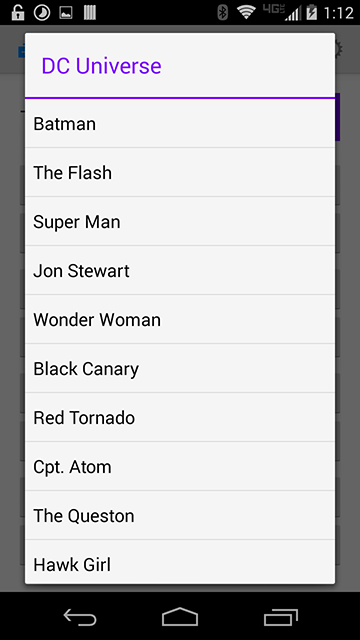

# PostOffice  
     

This is a library for easily constructing Holo and Material Design Dialogs in either Light or Dark modes, and are completely styleable and customizable. 

## Usage

Please refer to the [wiki](https://github.com/r0adkll/PostOffice/wiki) for a more detailed explanation of how to use this library.

Call `PostOffice.newMail()` to start building a new dialog. This method will return a `Delivery` object which is an interface into the actual system Dialog that is created from the builder. 

_OR_ 

Call one of the simpler quick call items;
	
	PostOffice.newAlertMail(Context, Title, Message)
	PostOffice.newAlertMail(Context, Title, Message, AlertHandler)
	PostOffice.newEditTextMail(Context, Title, Hint, InputType, OnTextAcceptedListener)
	PostOffice.newProgressMail(Context, Title, Suffix, Indeterminate);
	PostOffice.newSimpleListMail(Context, Title, Design, Contents[], OnItemAcceptedListener<T>)

### Mail Interface

	Delivery interface = PostOffice.newMail(Context)
			.setTitle(<CharSequence|Integer>)
			.setMessage(<CharSequence|Integer>)
			.setAutoLinkMask(Integer)
			.setMovementMethod(MovementMethod)
			.setIcon(Integer)
			
			.setButton(Integer, <CharSequence, Integer>, DialogInterface.OnClickListener)
			.setThemeColor(int color)
			.setThemeColorFromResource(int colorResId)
			
			.showKeyboardOnDisplay(Boolean)
			.setCancelable(Boolean)
			.setCanceledOnTouchOutside(Boolean)
			.setDesign(Designs.<HOLO|MATERIAL>_<LIGHT|DARK>)
			
			.setStyle(
				new EditTextStyle.Builder(Context)
					.setText(CharSequence)
					.setHint(CharSequence)
					.setTextColor(Integer)
					.setHintColor(Integer)
					.addTextWatcher(TextWatcher)
					.setInputType(Integer)
					.setOnTextAcceptedListener(OnTextAcceptedListener)
					.build
				new ProgressStyle.Builder(Context)
					.setSuffix(String)	
					.setCloseOnFinish(Boolean)
					.setPercentageMode(Boolean)
					.setInterdeterminate(Boolean)
					.build()
				new ListStyle.Builder(Context)
					.setDividerHeight(Float)
					.setDivider(Drawable)
					.setListSelector(<Integer|Drawable>)
					.setDrawSelectorOnTop(Boolean)
					.setFooterDividersEnabled(Boolean)
					.setHeaderDividersEnabled(Boolean)
					.addHeader(View)
					.addHeader(View, Object, Boolean)
					.addFooter(View)
					.addFooter(View, Object, Boolean)
					.setOnItemClickListener(OnItemClickListener)
					.setOnItemLongClickListener(OnItemLongClickListener)
					.setOnItemAcceptedListener(OnItemAcceptedListener<T>)
					.build(BaseAdapter)
			)
			.build();
			.show(FragmentManager, String);
			.show(FragmentTransaction, String);
			.show(android.support.v4.FragmentManager, String);
			.show(android.support.v4.FragmentTransaction, String);
			
			
### Delivery Interface

Here is the list of delivery interface methods

	.setOnCancelListener(DialogInterface.OnCancelListener)
	.setOnDismissListener(DialogInterface.OnDismissListener)
	.setOnShowListener(DialogInterface.OnShowListener)
	.getStyle()	
	
	.show(FragmentManager manager, String tag)
	.show(FragmentManager manager)
	.show(FragmentTransaction transaction, String tag)
    .show(FragmentTransaction transaction)
    
    .show(android.support.v4.app.FragmentManager, String tag)
    .show(android.support.v4.app.FragmentManager)
    .show(android.support.v4.app.FragmentTransaction, String tag)
    .show(android.support.v4.app.FragmentTransaction)
    
    .getMail()
    .getSupportMail()
    
	.dismiss()
	.dismissAllowStateLoss()
	
## Example Usage

	PostOffice.newAlertMail(ctx, R.string.title, R.string.message)
		      .show(getFragmentManager(), null);
		      
or
		      
	PostOffice.newMail(ctx)
			  .setTitle("Some awesome title")
			  .setMessage("Something cool just happened, check it out.")
			  .setIcon(R.drawable.ic_launcher)
			  .setThemeColor(R.color.app_color)
			  .setDesign(Design.MATERIAL_LIGHT)
			  .show(getFragmentManager());
			  
		    
## Screenshots
		    
  
    
    
  

## Going Forward
Here is a list of features I will add or look into adding in the near future. If you have any features you would like to add feel free to submit a Pull request or email me.  

-	**[DONE]** Add the ability to click links, and set the 'Movement Method' of the alert text view.
-	Make the Material Design actions up to spec, where if the text expands the button to > 124dp, then it will switch to stacking them.
-	Add dismissive actions, i.e. alt actions such as this: [Actions](https://www.google.com/design/spec/components/dialogs.html#dialogs-actions)

## Example

-	Try out the example on the PlayStore: [PostOffice Example](https://play.google.com/store/apps/details?id=com.r0adkll.postoffice.example)
	
## Implementing
Add this line to your gradle dependencies

	compile 'com.r0adkll:postoffice:{latest_version}'

## Author

-	Drew Heavner - [r0adkll](http://r0adkll.com)

## Attribution

-	[RippleView](https://github.com/siriscac/RippleView) - Muthuramakrishnan - [siriscac@gmail.com](mailto:siriscac@gmail.com)
	-	Used to produce the ripple affect on Material dialogs

## License

-	Apache License 2.0 - [LICENSE](LICENSE.md)
